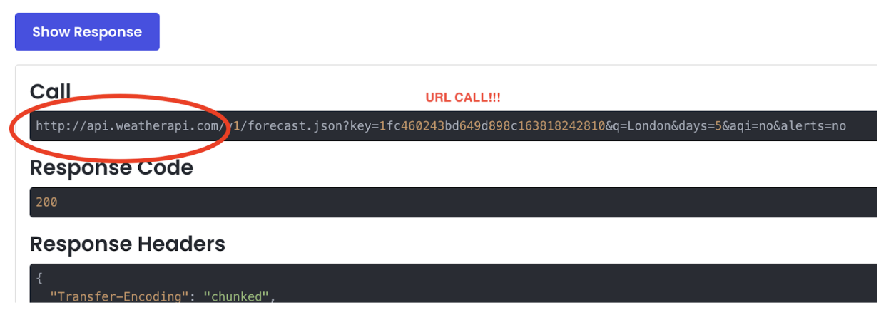

# Android Weather App Tutorial 🌤️

A comprehensive guide to building a weather application using Android, Kotlin, and modern Android development practices.
In this tutorial, you’ll learn to create a Weather App that utilizes Location and Context APIs to provide personalized and location-based weather information. We’ll leverage Retrofit libraries to handle network calls efficiently and design a user-friendly app that enhances user engagement with real-time updates through notifications.
## Table of Contents  
[Prerequisites](#prerequisites)  
[Project Setup](#project-setup)  
[Weather App Setup Instructions](#weather-app-setup-instructions)  
[Conclusion](#conclusion)  
[Resources](#resources)  


## Prerequisites

Before starting, ensure you have:
- Android Studio (latest stable version)
- Basic knowledge of Kotlin and Android development
- WeatherAPI.com account
- Android device or emulator for testing

  


## Project Setup

### Dependencies
Add these to your app-level `build.gradle`:

```gradle
dependencies {
    // Retrofit for network calls
    implementation 'com.squareup.retrofit2:retrofit:2.9.0'
    implementation 'com.squareup.retrofit2:converter-gson:2.9.0'
    
    // Android Jetpack Components
    implementation 'androidx.lifecycle:lifecycle-viewmodel-ktx:2.6.1'
    implementation 'androidx.lifecycle:lifecycle-livedata-ktx:2.6.1'
    
    // Google Play Services for Location
    implementation 'com.google.android.gms:play-services-location:21.0.1'
}
```

### Manifest Setup
Add these permissions to your `AndroidManifest.xml`:

```xml
<uses-permission android:name="android.permission.INTERNET"/>
<uses-permission android:name="android.permission.ACCESS_COARSE_LOCATION"/>
<uses-permission android:name="android.permission.ACCESS_FINE_LOCATION"/>
```

## Weather App Setup Instructions

### 1. Create a New Project
- Open Android Studio.
- Create a new project with Jetpack Compose support.

### 2. Create Weather Page Composable
```kotlin
fun WeatherPage(viewModel: WeatherViewModel) {
    // Your WeatherPage implementation here
}
```

### 3. Create ViewModel in Main Activity
- Instantiate `WeatherViewModel` in your `MainActivity`.

### 4. Create Search Bar
- Add a search bar using any method you prefer.

### 5. Create WeatherViewModel and Data Function
- Define `WeatherViewModel`.
- Create a function to fetch data:
```kotlin
fun getData(city: String) {
    // Fetch weather data
}
```

### 6. Create `api` Package
- For better organization, create a package named `api`.

#### Create `RetrofitInstance`
```kotlin
object RetrofitInstance {
    private fun getInstance(): Retrofit {
        return Retrofit.Builder()
            .baseUrl(YourBaseURL)
            .addConverterFactory(GsonConverterFactory.create())
            .build()
    }

    val weatherApi: WeatherAPI = getInstance().create(WeatherAPI::class.java)
}
```

### 7. Obtain API Key and Base URL
- Go to [WeatherAPI](https://www.weatherapi.com/).
- Create an account, log in, and obtain your API key and base URL.
- Use the API Explorer to test the API.

    

- In the interactive API Explore Paste your API
- Make sure you format is in JSON
- And your parameter values are “London”(or any city of your preference) and your days are set to “5”
- Press show response button
  
  

- You will get an example URL call
- The beginning of the call is your base URL call

- The Response body is what the API will be sending to your application
- It has all the information that you want to display on you app
- Copy all of this response body section!


### 8. Create `WeatherAPI` Interface
```kotlin
interface WeatherAPI {
    @GET("/v1/forecast.json")
// Define a GET request to the forecast endpoint
// Declare a suspend function to fetch weather data   asynchronously

    suspend fun getWeather(
 // The API key required for authenticating the request
        @Query("key") apikey: String, 
        @Query("q") city: String,
        @Query("days") days: String
    ): Response<WeatherModel>
}

```
- We want to generate our URL call…
  

### 9. Generate `WeatherModel`
- Create `WeatherModel.kt` in the `api` package.
- Paste the JSON response into a Kotlin data class generator.
- it will populate the api package with these...
  
  


### 10. Update `WeatherViewModel`
- Integrate the API in `WeatherViewModel`.
- Use coroutines to handle API calls:
```kotlin
fun getData(city: String, days: String) {
    viewModelScope.launch {
        val response = weatherApi.getWeather(YOUR_API_KEY, city, days)
        if (response.isSuccessful) {
            // Process the response
        } else {
            // Handle errors
        }
    }
}
```

### 11. Observe LiveData in WeatherPage
```kotlin
val weatherResult = viewModel.weatherResult.observeAsState()
```

### 12. Finally use your API/ Create WeatherDetails Composable
```kotlin
@Composable
fun WeatherDetails(data: WeatherModel) {
    Text(text = data.location.name, fontSize = 30.sp)
    Text(text = "${data.current.temp_f}°F", fontSize = 56.sp)
}
```

### 13. (For setting up current location ability) Setup Location Access
#### Permissions
Add these permissions to `AndroidManifest.xml`:
```xml
<uses-permission android:name="android.permission.ACCESS_COARSE_LOCATION"/>
<uses-permission android:name="android.permission.ACCESS_FINE_LOCATION"/>
```

#### Request Runtime Permissions
```kotlin
if (ContextCompat.checkSelfPermission(this, Manifest.permission.ACCESS_FINE_LOCATION)
    != PackageManager.PERMISSION_GRANTED) {
    ActivityCompat.requestPermissions(
        this,
        arrayOf(Manifest.permission.ACCESS_FINE_LOCATION),
        LOCATION_PERMISSION_REQUEST_CODE
    )
}
```

#### Setup Fused Location Provider
```kotlin
val fusedLocationClient = LocationServices.getFusedLocationProviderClient(this)

fusedLocationClient.lastLocation.addOnSuccessListener { location: Location? ->
    if (location != null) {
        val latitude = location.latitude
        val longitude = location.longitude
        Log.d("Location", "Latitude: $latitude, Longitude: $longitude")
    } else {
        Log.d("Location", "No location found")
    }
}
```

#### Handle Permission Response
```kotlin
override fun onRequestPermissionsResult(
    requestCode: Int,
    permissions: Array<out String>,
    grantResults: IntArray
) {
    super.onRequestPermissionsResult(requestCode, permissions, grantResults)
    if (requestCode == LOCATION_PERMISSION_REQUEST_CODE) {
        if (grantResults.isNotEmpty() && grantResults[0] == PackageManager.PERMISSION_GRANTED) {
            // Permission granted
        } else {
            // Permission denied
        }
    }
}
```

---

## Conclusion

### Summary
This tutorial demonstrated building a weather app with authentication, location-based weather, search functionality, saved favorites, and notifications. The app incorporates essential features to provide a seamless user experience, leveraging Android's powerful tools and libraries.

### Alternative Approaches
- **Data Storage**: Instead of using Room for local data storage, SharedPreferences can be utilized for simpler data persistence.
- **Weather APIs**: Other weather APIs such as AccuWeather and WeatherStack can be used as alternatives to the one demonstrated in this tutorial.

### Related Platform Features
- **Android Jetpack WorkManager**: Ideal for managing background tasks like periodic weather updates.
- **Android Notifications**: Provides user engagement through timely weather alerts and updates.

### Source Code
The complete source code for this project is available on GitHub: [WeatherAPIapp GitHub Repository](https://github.com/katiestacey44/WeatherAPIapp.git)


## Resources

- [Retrofit Documentation](https://square.github.io/retrofit/)
- [Android Location Services](https://developer.android.com/training/location)
- [WeatherAPI Documentation](https://www.weatherapi.com/docs/)

## Youtube Tutorials
- [Current location](https://www.youtube.com/watch?v=oqrbggPlASs)
- [Retrofit and api](https://www.google.com/search?q=weather+app+with+retrofit+screen&rlz=1C1GCEA_enUS1045US1045&oq=weather+app+with+retrofot+&gs_lcrp=EgZjaHJvbWUqCQgBECEYChigATIGCAAQRRg5MgkIARAhGAoYoAEyCQgCECEYChigATIJCAMQIRgKGKABMgkIBBAhGAoYoAEyCQgFECEYChirAjIHCAYQIRifBTIHCAcQIRiPAjIHCAgQIRiPAtIBCDg0NDdqMGo3qAIIsAIB&sourceid=chrome&ie=UTF-8#fpstate=ive&vld=cid:5f097b4d,vid:Kn6vUH1uJT4,st:0 )

## Important Notes

> ⚠️ Remember to replace `YOUR_API_KEY` with your actual WeatherAPI.com API key.

> 🔒 Never commit API keys directly in your code. Use environment variables or a secure configuration file.


---
Made with ❤️ by Catherine Stacey, Gabrielle Munson, and Blaze Lauer.
